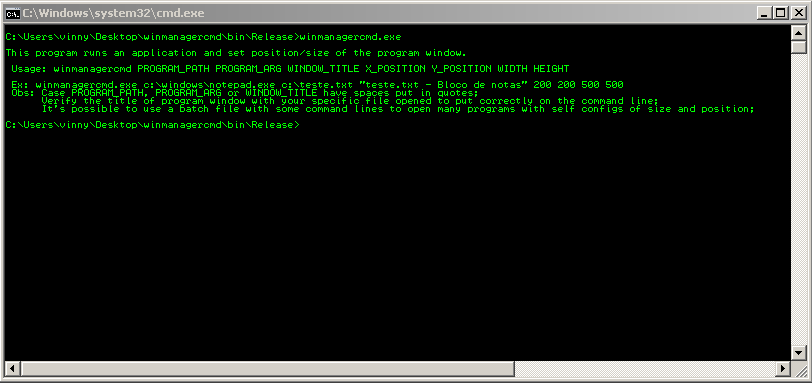
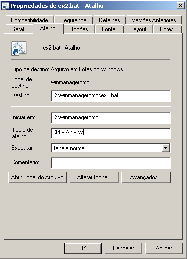

# winmanagercmd
Run Resize and Reposition your Apps with one shortcut

<h3 align="center">
  
</h3>

With all config done, just one shortcut do all you need.

Steps: 
- Create a new batch file with commands to Run Resize and Reposition your common aplications;
ex: ex2.bat

- Create a shortcut for the batch file and insert a key shortcut by right click on shortcut addind the key shortcut

<h3 align="center">
  
</h3>

- Put the shortcut on desktop to be able to use

## Créditos
[llBALAll](https://github.com/llBALAll)